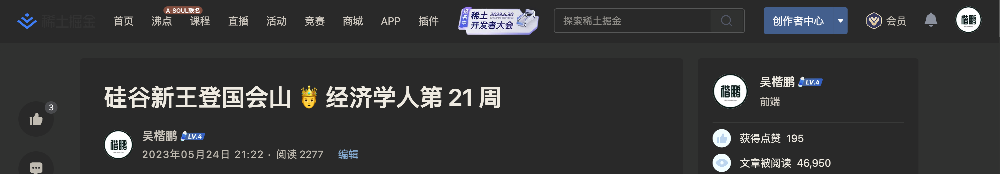

# 给微信文章、掘金文章标题添加表情（Emoji）

以下表情包（emoji）可以复制，然后在微信公众号文章、掘金文章标题中使用，如上图：

| Emoji | Name | Emoji | Name | Emoji | Name |
| ----- | ---- | ----- | ---- | ----- | ---- |
| 🤨    | 皱眉 | 🤣    | 笑瘫了 | 🤤    | 流口水 |
| 🤩    | 星星眼 | 🤗    | 拥抱 | 🤕    | 受伤 |
| 🤐    | 闭嘴 | 🤔    | 思考 | 🤒    | 发烧 |
| 🤓    | 书呆子 | 🤑    | 财迷 | 🤢    | 恶心 |
| 🤮    | 呕吐 | 🤭    | 偷笑 | 🤫    | 嘘 |
| 🧐    | 单片眼镜 | 🤯    | 爆炸头 | 🤪    | 咧嘴笑 |
| 🤥    | 长鼻子 | 🤧    | 打喷嚏 | 🤬    | 咒骂 |
| 🤡    | 小丑脸 | 🤠    | 牛仔帽 | 🤰    | 孕妇 |
| 🤵    | 新郎 | 🤶    | 克劳斯夫人 | 🤴    | 王子 |
| 🤷    | 耸肩 | 🤦    | 沮丧 | 🤸    | 体操 |
| 🤼    | 摔跤 | 🥪    | 三明治 | 🥗    | 沙拉 |
| 🥟    | 饺子 | 🥫    | 罐头 | 🥨    | 椒盐卷饼 |
| 🥧    | 馅饼 | 🥄    | 勺子 | 🥤    | 麦秆杯 |
| 🥜    | 花生 | 🦐    | 虾 | 🥓    | 培根 |
| 🥒    | 黄瓜 | 🥙    | 填充面包 | 🥚    | 蛋 |
| 🥐    | 羊角面包 | 🥞    | 煎饼 | 🥩    | 牛排 |
| 🥛    | 牛奶 | 🥘    | 海鲜饭 | 🥂    | 干杯 |
| 🥃    | 朗姆酒 | 🥢    | 筷子 | 🥥    | 椰子 |
| 🥝    | 奇异果 | 🥑    | 牛油果 | 🥔    | 土豆 |
| 🥕    | 胡萝卜 | 🥖    | 长棍面包 | 🦂    | 蝎子 |
| 🦉    | 猫头鹰 | 🦗    | 蟋蟀 | 🦕    | 恐龙

- 知乎没有限制，可以使用任何 emoji
- CSDN 无法使用 emoji，编辑的时候正常显示，但是文章发表后会被删除掉

> 个人公众号：**楷鹏**