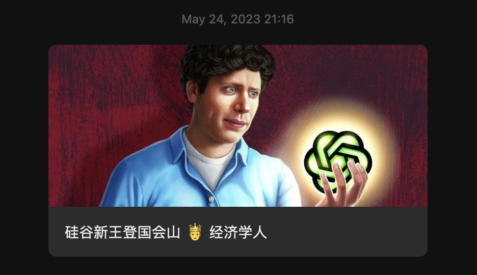

# 给微信文章、掘金文章标题添加表情（Emoji）




以下表情包（emoji）可以复制，然后在微信公众号文章、掘金文章标题中使用，如上图：

```json
[
    {
        "emoji": "🤨",
        "name": "皱眉"
    },
    {
        "emoji": "🤣",
        "name": "笑瘫了"
    },
    {
        "emoji": "🤤",
        "name": "流口水"
    },
    {
        "emoji": "🤩",
        "name": "星星眼"
    },
    {
        "emoji": "🤗",
        "name": "拥抱"
    },
    {
        "emoji": "🤕",
        "name": "受伤"
    },
    {
        "emoji": "🤐",
        "name": "闭嘴"
    },
    {
        "emoji": "🤔",
        "name": "思考"
    },
    {
        "emoji": "🤒",
        "name": "发烧"
    },
    {
        "emoji": "🤓",
        "name": "书呆子"
    },
    {
        "emoji": "🤑",
        "name": "财迷"
    },
    {
        "emoji": "🤢",
        "name": "恶心"
    },
    {
        "emoji": "🤮",
        "name": "呕吐"
    },
    {
        "emoji": "🤭",
        "name": "偷笑"
    },
    {
        "emoji": "🤫",
        "name": "嘘"
    },
    {
        "emoji": "🧐",
        "name": "单片眼镜"
    },
    {
        "emoji": "🤯",
        "name": "爆炸头"
    },
    {
        "emoji": "🤪",
        "name": "咧嘴笑"
    },
    {
        "emoji": "🤥",
        "name": "长鼻子"
    },
    {
        "emoji": "🤧",
        "name": "打喷嚏"
    },
    {
        "emoji": "🤬",
        "name": "咒骂"
    },
    {
        "emoji": "🤡",
        "name": "小丑脸"
    },
    {
        "emoji": "🤠",
        "name": "牛仔帽"
    },
    {
        "emoji": "🤰",
        "name": "孕妇"
    },
    {
        "emoji": "🤵",
        "name": "新郎"
    },
    {
        "emoji": "🤶",
        "name": "克劳斯夫人"
    },
    {
        "emoji": "🤴",
        "name": "王子"
    },
    {
        "emoji": "🤷",
        "name": "耸肩"
    },
    {
        "emoji": "🤦",
        "name": "沮丧"
    },
    {
        "emoji": "🤸",
        "name": "体操"
    },
    {
        "emoji": "🤼",
        "name": "摔跤"
    },
    {
        "emoji": "🥪",
        "name": "三明治"
    },
    {
        "emoji": "🥗",
        "name": "沙拉"
    },
    {
        "emoji": "🥟",
        "name": "饺子"
    },
    {
        "emoji": "🥫",
        "name": "罐头"
    },
    {
        "emoji": "🥨",
        "name": "椒盐卷饼"
    },
    {
        "emoji": "🥧",
        "name": "馅饼"
    },
    {
        "emoji": "🥄",
        "name": "勺子"
    },
    {
        "emoji": "🥤",
        "name": "麦秆杯"
    },
    {
        "emoji": "🥜",
        "name": "花生"
    },
    {
        "emoji": "🦐",
        "name": "虾"
    },
    {
        "emoji": "🥓",
        "name": "培根"
    },
    {
        "emoji": "🥒",
        "name": "黄瓜"
    },
    {
        "emoji": "🥙",
        "name": "填充面包"
    },
    {
        "emoji": "🥚",
        "name": "蛋"
    },
    {
        "emoji": "🥐",
        "name": "羊角面包"
    },
    {
        "emoji": "🥞",
        "name": "煎饼"
    },
    {
        "emoji": "🥩",
        "name": "牛排"
    },
    {
        "emoji": "🥛",
        "name": "牛奶"
    },
    {
        "emoji": "🥘",
        "name": "海鲜饭"
    },
    {
        "emoji": "🥂",
        "name": "干杯"
    },
    {
        "emoji": "🥃",
        "name": "朗姆酒"
    },
    {
        "emoji": "🥢",
        "name": "筷子"
    },
    {
        "emoji": "🥥",
        "name": "椰子"
    },
    {
        "emoji": "🥝",
        "name": "奇异果"
    },
    {
        "emoji": "🥑",
        "name": "牛油果"
    },
    {
        "emoji": "🥔",
        "name": "土豆"
    },
    {
        "emoji": "🥕",
        "name": "胡萝卜"
    },
    {
        "emoji": "🥖",
        "name": "长棍面包"
    },
    {
        "emoji": "🦂",
        "name": "蝎子"
    },
    {
        "emoji": "🦉",
        "name": "猫头鹰"
    },
    {
        "emoji": "🦗",
        "name": "蟋蟀"
    },
    {
        "emoji": "🦕",
        "name": "恐龙"
    },
    {
        "emoji": "🦀",
        "name": "螃蟹"
    },
    {
        "emoji": "🦋",
        "name": "蝴蝶"
    },
    {
        "emoji": "🦑",
        "name": "鱿鱼"
    },
    {
        "emoji": "🦎",
        "name": "蜥蜴"
    },
    {
        "emoji": "🦆",
        "name": "鸭子"
    },
    {
        "emoji": "🦊",
        "name": "狐狸"
    },
    {
        "emoji": "🦓",
        "name": "斑马"
    },
    {
        "emoji": "🦈",
        "name": "鲨鱼"
    },
    {
        "emoji": "🦍",
        "name": "猩猩"
    },
    {
        "emoji": "🦇",
        "name": "蝙蝠"
    },
    {
        "emoji": "🦏",
        "name": "犀牛"
    },
    {
        "emoji": "🦒",
        "name": "长颈鹿"
    },
    {
        "emoji": "🦌",
        "name": "鹿"
    },
    {
        "emoji": "🦅",
        "name": "鹰"
    },
    {
        "emoji": "🦃",
        "name": "火鸡"
    },
    {
        "emoji": "🥀",
        "name": "死花"
    },
    {
        "emoji": "🥋",
        "name": "武术服"
    },
    {
        "emoji": "🥌",
        "name": "冰石"
    },
    {
        "emoji": "⌨",
        "name": "键盘"
    },
    {
        "emoji": "⏱",
        "name": "秒表"
    },
    {
        "emoji": "🤺",
        "name": "击剑"
    },
    {
        "emoji": "🧥",
        "name": "外套"
    },
    {
        "emoji": "🧦",
        "name": "短袜"
    },
    {
        "emoji": "🧤",
        "name": "手套"
    },
    {
        "emoji": "🧣",
        "name": "围巾"
    },
    {
        "emoji": "🧢",
        "name": "帽子"
    },
    {
        "emoji": "🥊",
        "name": "拳套"
    },
    {
        "emoji": "⏰",
        "name": "闹钟"
    },
    {
        "emoji": "⌚",
        "name": "手表"
    },
    {
        "emoji": "🤳",
        "name": "自拍"
    },
    {
        "emoji": "🤽",
        "name": "水球"
    },
    {
        "emoji": "🤾",
        "name": "手球"
    },
    {
        "emoji": "🤹",
        "name": "杂耍"
    },
    {
        "emoji": "🥅",
        "name": "目标网"
    },
    {
        "emoji": "🥁",
        "name": "鼓"
    },
    {
        "emoji": "⏬",
        "name": "下"
    },
    {
        "emoji": "⏫",
        "name": "上"
    },
    {
        "emoji": "⏩",
        "name": "右"
    },
    {
        "emoji": "⏪",
        "name": "左"
    },
    {
        "emoji": "🥇",
        "name": "金牌"
    },
    {
        "emoji": "🥈",
        "name": "银牌"
    },
    {
        "emoji": "🥉",
        "name": "铜牌"
    },
    {
        "emoji": "🤝",
        "name": "握手"
    },
    {
        "emoji": "🤛",
        "name": "左拳"
    },
    {
        "emoji": "🤞",
        "name": "比心"
    },
    {
        "emoji": "🤜",
        "name": "右拳"
    },
    {
        "emoji": "🤚",
        "name": "举手"
    },
    {
        "emoji": "🤙",
        "name": "电联我"
    },
    {
        "emoji": "9️⃣",
        "name": "9"
    },
    {
        "emoji": "8️⃣",
        "name": "8"
    },
    {
        "emoji": "7️⃣",
        "name": "7"
    },
    {
        "emoji": "6️⃣",
        "name": "6"
    },
    {
        "emoji": "2️⃣",
        "name": "2"
    },
    {
        "emoji": "3️⃣",
        "name": "3"
    },
    {
        "emoji": "4️⃣",
        "name": "4"
    },
    {
        "emoji": "5️⃣",
        "name": "5"
    },
    {
        "emoji": "1️⃣",
        "name": "1"
    },
    {
        "emoji": "0️⃣",
        "name": "0"
    },
    {
        "emoji": "#️⃣",
        "name": "#"
    },
    {
        "emoji": "‍",
        "name": "空白字符"
    },
    {
        "emoji": "█",
        "name": "刮奖"
    }
]
```


- 知乎没有限制，可以使用任何 emoji
- CSDN 无法使用 emoji，编辑的时候正常显示，但是文章发表后会被删除掉

> 个人公众号：**楷鹏**